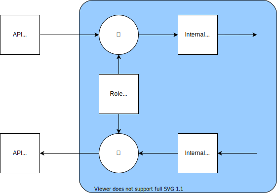



# Introduction

In tree-ware, all functionality is achieved using operators that operate on one or more model trees. The same applies to
RBAC. RBAC operators operate on two model trees: a request (or response) model tree, and a role model tree.

The RBAC operators are similar to intersection operators. Their output is a model tree that only has model nodes that
are in both input model trees. This results in only permitting request (or response) nodes that are in the role model
tree. The actual operators are slightly more complicated than intersection operators since they have to take into
consideration the permissions in the role model tree.

The following diagram shows how RBAC operators are used when a get-request is made. The get-response is also operated on
for safety reasons to ensure nothing slips through.

RBAC operators are used similarly when a set-request is made. The set-response is an error model (if there are errors),
so it can be returned as-is without an RBAC operator.

# Set-Request Access Control

The `permitSet()` operator is for controlling the access of a set-request.

## TODO

* Design
* Assign association value only if user has access to the target.
    * Currently, it is sufficient to have `read` permission on the target to be able to assign the association.
    * But should a special `associate` permission on the target be introduced for this purpose to avoid giving users
      read access to the target?

# Get-Request/-Response Access Control

The `permitGet()` operator is for controlling the access of a get-request or get-response.

## TODO

* Design
